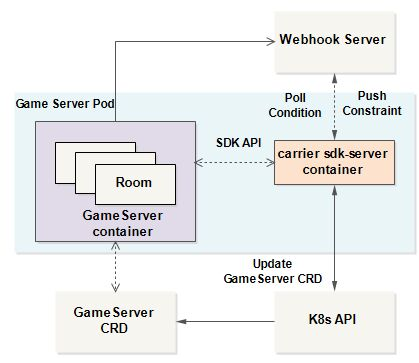

# Carrier SDK

The SDKs are integration points for game servers with Carrier itself.

## The relationship between GameServer and Carrier SDK



* SDK-Server is run as sidecar container of game server container in the same K8s pod.

* game server connect to sdk-server through the SDK API. Or sdk-server poll the application webhook server.

* SDK-Server connect to the K8s API, and update the `GameServer` CRD.

## Connecting to the SDK Server

When create `GameServer`, we can set the port that the SDK server listens on for incoming gRPC or HTTP requests.
Carrier will automatically set the following environment variables on all game server containers:

* `CARRIER_SDK_GRPC_PORT`: The port where the gRPC server is listening (defaults to 9020)
* `CARRIER_SDK_HTTP_PORT`: The port where the grpc-gateway is listening (defaults to 9021)

## Application webhook

If the application does not want to directly access the SDK-Server, it can provide a webhook to allow the SDK-Server to access the webhook.

1.At first, we define a webhook, such as:

```yaml
apiVersion: carrier.ocgi.dev/v1alpha1
kind: WebhookConfiguration
metadata:
  name: ds-webhook
  namespace: default
webhooks:
  - clientConfig:
      url: http://ds.carrier.dev/server-ready
    name: server-ready
    type: ReadinessWebhook
```

2.Define a GameServer which access the webhook.

```yaml
apiVersion: carrier.ocgi.dev/v1alpha1
kind: GameServer
metadata:
  annotations:
    carrier.ocgi.dev/webhook-config-name: ds-webhook # should be the webhook name
  name: ds-server
  namespace: default
spec:
  health:
    disabled: true # don't access SDK-Server
  readinessGates:
    - server-ready # readiness gate name should be same as the readiness gate name in webhook
```

3.SDK-Server will periodically access webhook service, and update the GameServer's conditions.

## SDK API

Refer to the [SDK gRPC API](./docs/API.md) and [SDK HTTP API](./docs/HTTP_API.md).

* [go sdk](./sdks/sdkgo)

  [simple-tcp](https://github.com/ocgi/sdk-examples/tree/master/simple-tcp) is an example of using go sdk.

* [c++ sdk](./sdks/sdkcpp)

  [sdk-examples-cpp](https://github.com/ocgi/sdk-examples-cpp) is an example of using c++ sdk.

## Licence

The project is licensed under the Apache License, Version 2.0. See [LICENSE](./LICENSE.md) for the full license text.
